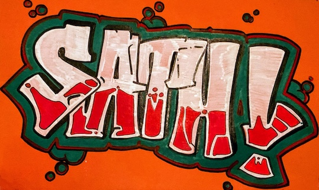

<div style="text-align: center;">

## What's up Internet! I'm Sathwik 👋

#### Welcome to My Code Library 👨‍💻

</div>

<p align="center">
  
</p>

<h2 align="center" style="font-weight: 300; color: #988e9f; margin-bottom: 25px;">&lt;About /&gt;</h2> 

```javascript
class Sathwik Kesappragada {
  const ABOUT = `
    Hello 👋👋, I'm Sathwik Kesappragada, an accomplished Data Analyst with a passion for crafting user-centric web solutions.
    With over three years of experience in the industry, I have developed a keen expertise in HTML, CSS, JavaScript, and Vue.js.
    My journey has led me to deliver high-quality web applications, including a notable project that significantly improved user engagement.

    I'm ambitious and love new challenges :)
    My vast variety of skills is continuously expanding.
    `

  constructor() {
    this.name = "Sathwik Kesappragada"
    this.about = ABOUT
    this.email = "sathwik.kesappragada97@@gmail.com"
    this.userName = "sathwikkes"
    this.dayOfBirthTimestamp = 870924739
    this.location = "Rajahmundry, Andra Pradhesh, India"
  }

  workExperience() {
    return [
      '...|'
      { "2022-present": "Data Viz Teaching Asst @ 2U" },
      { "2022-2023"   : "Associate Analyst @ Infosys" },
      { "2020-2021"   : "Data Science Fellow @ Springboard" }
    ]
  }

  education() {
    return [
      { "2022-2022": "Business Analysis for Digital Transformation @ Trinity College" },
      { "2020-2021": "Data Science Career Track @ Springboard" },
      { "2015-2020": "Applied Mathematics, Bachelor's degree @ University of California, Riverside" }
    ]
  }

  skills() {
    return [
      'HTML', 'CSS', 'JavaScript', 'React',
      'Python', 'R',
      'D3.js', 'Plotly.js', 'React', 
      'Visual Studio Code', 'Excel', 'Tableau', 'AWS', 'Snowflake',  // ->> Developer Tools
      'npm/yarn', 'Webpack/Vite', 'Git/GitHub/GitLab',
      'Node.js', 'SQLite', 'MongoDB', 'PostgreSQL',
      'Python', '...|'
    ]
  }

  extracurricular() {
    return [
        'Basketball' 🏀,
        'Cricket' 🏏, 
        'Film' 🎥, 
        'Traveling' ✈️, 
        'Cars' 🏎️, 
    ]
  }

  socialMedia() {
    return [
        {'LinkedIn': 'https://www.linkedin.com/in/sathwik-kesappragada/'},
        {'Twitter': 'https://twitter.com/fratwik'},
        {'Tableau':'...'}
  }
}
```

<div style="display: flex; justify-content: space-between;">
  <a href="https://github.com/sathwikkes/github-readme-stats">
    
  </a>
  <a href="https://github.com/sathwikkes/github-readme-stats">
    
  </a>
</div>
